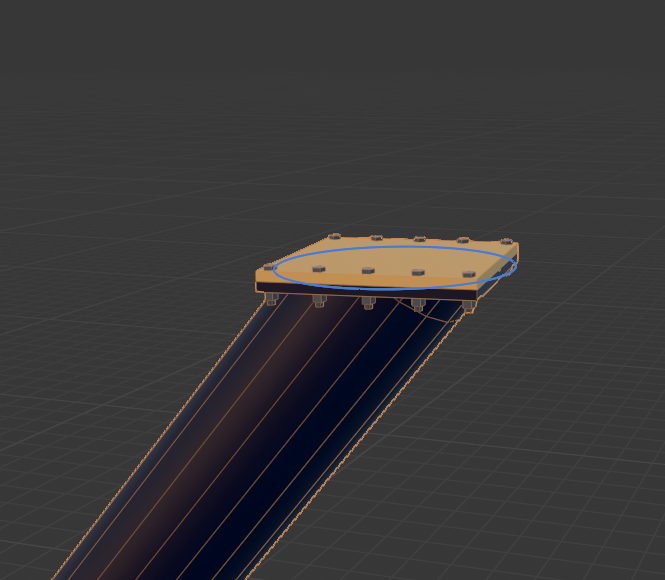
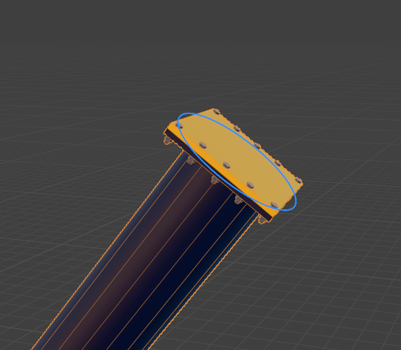
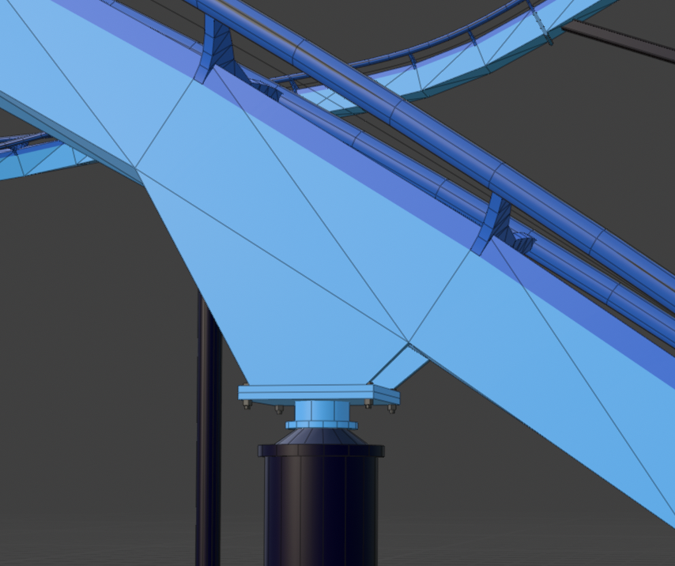
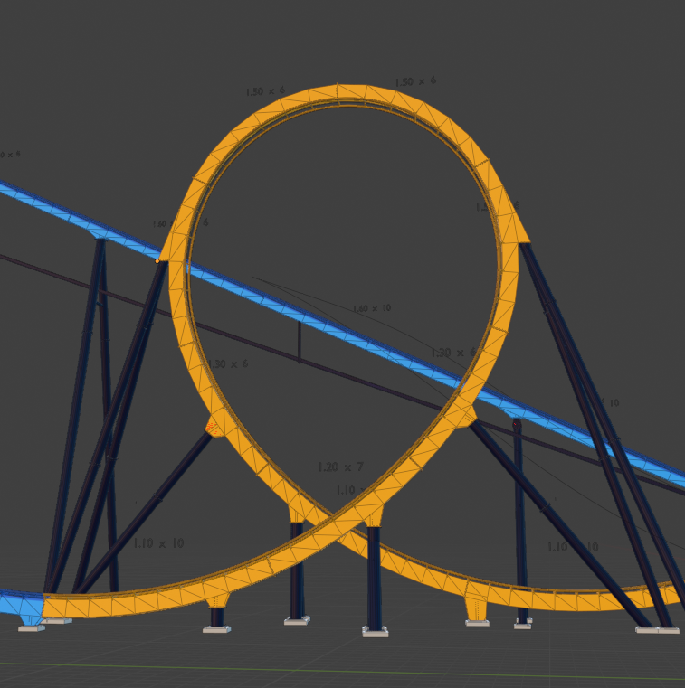

Hello again! This was my first stream in over a year, and it was nice to be able to do it again. I'm not back to a set streaming schedule again, but it's still nice to at least be able to even stream again at all!

## Updating Tools

I went over the progress that I've made with my tools over the last year, pointing out a few differences in the old and new versions. I don't believe I mentioned this in the stream, but it's worth saying now; I'm planning on publishing tools _after_ being able to use them to complete a model. If there are any updates that need to be added, I can add them as I build the project.

This gives me guard rails as to how far I can go down an unrelated rabbit hole. I want to be able to stay on topic when building. (That's the whole reason for streaming in the first place!)

## B&M Support Tool Fixes

The main fix was adding a toggle to the `Vertical Mount (Lg)` that either locks its rotation to match the curve tangent or stay parallel to the ground to make A-shaped supports.

Additionally, I made the texturing of `Vertical Mount (Sm)` a bit more accurate (for solid colors) and fixed a bug for the `Mounting Plate` on the `Universal Mount`.

## Track Modeling

After fixing the Support Tool, I finished the loop section. I didn't bother to organize the collections or even texture the track mounting brackets, but the actual modeling for this section is mostly completed. I'll have to fix up the highly angled supports.

