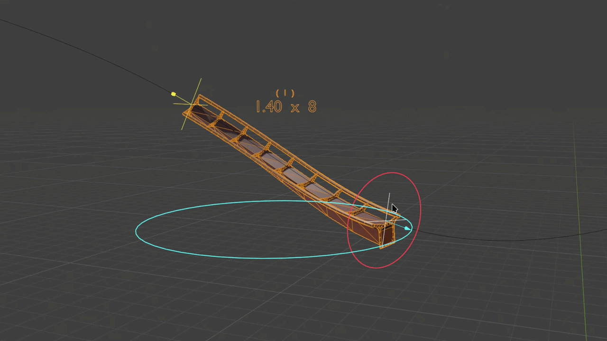
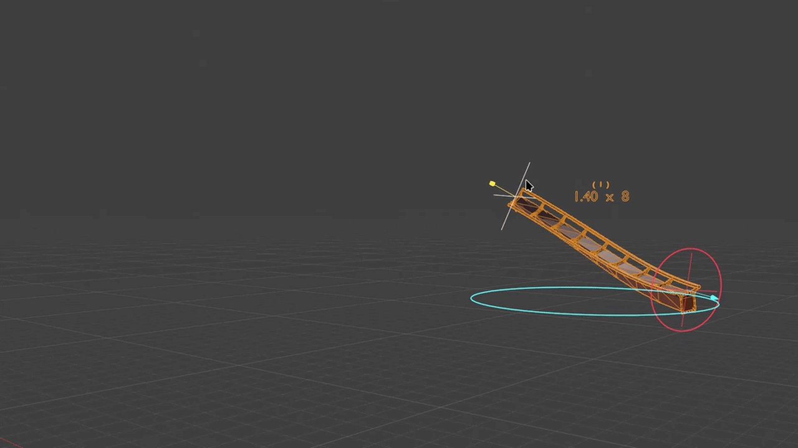
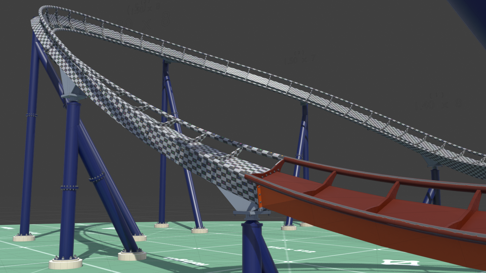

**Included in download:**

- Demo model
- _RG-B&M_Track_Generator_v33_ `.blend` file
- _RG-Utility_Nodes_v10_ `.blend` file
- Track Textures
- Track UV Map

## Configure Track Variables

Manipulate the size, shape, and position of each track segment.

> 
> Customize a full zone of up to 10 track segments. Each zone has its own scoped variables (including position and track texture) and allow individual track segment properties for size, shape, etc.
>
> Edit individual track segment position, length, and cross-tie spacing all in object mode using gizmos.

## Shape Track

Select any curve/spline to determine the shape each track segment based on the starting positions for each segment (or zone) of track.

When positioning track segments, there is an option to resample the track spline to position segments at specific points to allow seamless connection points. _This is helpful when editing in sections with similar crosstie spacing._

> 
> Position the starting point of a track zone (which may include only one (1) track segment). Additional track segments will start exactly where the previous segment ended for seamless track flange connection points.

## Style Track Sections

Select standard or inverted track style rather than have to manually invert track spline. You can also toggle between generation styles.

> 
> Add a texture to a track zone. There are track textures provided to try, or feel free to use the included UV map to create your own.

## Track Generator Properties

These are all of the editable properties included with this tool.

**General**

- Spline Object
- Spline Point Distance
- Track Texture
- Track Count
- Track Orientation
- Track Position _(Prototype Version)_
- Track Offset _(Prototype Version)_
- Zone Origin Position _(Full Version) \*Gizmo_
- Zone Origin Offset _(Full Version) \*Gizmo_
- Rail Resolution
- Rail Segments

**Individual Track Section**

- Segment Count _\*Gizmo_
- Segment Length _\*Gizmo_
- G-Force Start
- G-Force End
- G-Force Taper Count
- UV Adjustment
    - Mirror UVs
    - X-Translate Offset
    - Y-Translate Offset

## Let Me Know What You Think!

If you come across any bugs or issues, send a message below in the contact form or email me at [message@rollygon.com](mailto:message@rollygon.com). I would love to hear your feed back to improve these tools.

Please, do not distribute or re-sell this product. Thank you!**Included in download:**
